# Architecture

Nautilius Prompting Workbench is a **local-first long-horizon coding-agent prompting workbench**. It helps you turn a coding task into a 16-question operational contract, draft the prompt, review similarity to prior work, optimize for **clarity** (not token cost), export structured specs plus rendered prompts, and store them in a local file registry—all on your machine.

It is **not** an autonomous agent platform. There is no background task runner, no tool-use loop, and no implicit model calls. Every stage is user-initiated and state-gated.

## Local-first design

All durable data lives under the repo (or configured paths):

| Path | Contents |
|------|----------|
| `data/registry/` | Local finalized prompts (`metadata.yaml`, canonical bodies, requirement cards) |
| `data/artifacts/` | Generated exports (TXT, Markdown, HTML, PDF, metrics, manifest) |
| `data/audit/` | Append-only external-inference audit log |
| `data/similarity_index.json` | Optional JSON embedding index (SQLite/Postgres alternative) |
| `data/model-cache/` | Hugging Face / sentence-transformers cache for local embeddings |

The API runs locally (`127.0.0.1:8000` by default). The web UI talks only to that API. LLM calls for clarification and draft generation use a **local OpenAI-compatible endpoint** when configured; otherwise services fall back to deterministic rule-based logic.

External cloud inference is **opt-in**, **explicitly approved per request**, and **audited**. See [privacy-model.md](privacy-model.md).

## Workbench, not agent platform

| Nautilius Prompting Workbench | Autonomous agent platform |
|--------------|---------------------------|
| User drives each workflow step | System plans and executes multi-step tasks |
| Fixed session state machine | Open-ended tool loop |
| RequirementCard + plain-text draft contract | Ad-hoc message history |
| Pre-inference quality gate before export | Post-hoc evaluation optional |
| Registry + RAG index for retrieval | Ephemeral chat sessions |
| One optional `send-to-inference` after approval | Continuous model access |

The product optimizes for **auditable long-horizon prompt design**: structured intake, versioned drafts, frozen canonical text, clarity-first optimization, and file-based exports suitable for review and Git diff.

## Runtime components

```mermaid
flowchart TB
  User[User] --> Web[apps/web]
  Web --> API[apps/api FastAPI]
  API --> SessionSvc[SessionService]
  SessionSvc --> Registry[data/registry Git]
  SessionSvc --> Artifacts[data/artifacts]
  SessionSvc --> Similarity[Similarity index]
  SessionSvc --> Optimizer[TokenOptimizationEngine]
  SessionSvc -. optional explicit .-> External[External LLM]
  External --> Audit[data/audit JSONL]
  Similarity --> Embed[EmbeddingService local HF or fallback]
  SessionSvc --> LocalLLM[Local OpenAI-compatible LLM]
```



`SessionService` (`apps/api/prompt_piper_api/services/session_service.py`) orchestrates the workflow. Routes in `apps/api/prompt_piper_api/routes/` are thin wrappers that map HTTP to service methods and return `SessionDetailResponse` payloads.

## Session state machine

States are defined in `SessionState` (`apps/api/prompt_piper_api/domain/enums.py`):

| State | Meaning |
|-------|---------|
| `intake` | Session created; initial request extracted to RequirementCard |
| `clarifying` | Clarification questions pending (dynamic loop, up to 10) |
| `edit` | Initial draft exists; user may apply edit instructions |
| `finalized` | Reserved enum value; runtime transitions skip directly to similarity |
| `similarity_check` | Canonical draft frozen; registry written; similarity indexed |
| `optimization` | Clarity optimizer has run; awaiting user approval |
| `approval` | Optimization passed quality gate; ready for artifact export |
| `artifact_generation` | Reserved; generation transitions directly to `exported` |
| `exported` | Artifacts written under `data/artifacts/{prompt_id}/` |

Primary transitions (enforced by `StateTransitionError` on invalid actions):

```
intake → clarifying (loop) → edit
edit → (edit)* → finalize → similarity_check
similarity_check → optimize → optimization
optimization → approve_optimization → approval
approval → generate_artifacts → exported
```

After finalization the canonical draft is **frozen** (`is_frozen=True`). Edits are rejected. Draft versions remain in the session record for audit; only the selected version becomes canonical.

`prompt_id` is assigned at finalize: `{slug-from-title}-{first-8-chars-of-session-uuid}` via `build_prompt_id()`.

## RequirementCard (task identity + 16-question agent contract)

The RequirementCard (`apps/api/prompt_piper_api/domain/requirement_card.py`) is the structured source of truth for a long-horizon coding-agent prompt. It is populated incrementally:

1. **Initial extraction** — `RequirementCardExtractor` parses the user's opening request into `task_identity` (objective, task type, environment).
2. **Clarification answers** — 16 operational-control questions update dotted leaf paths. Selecting a recommended default expands to the full deterministic policy text.
3. **Edit instructions** — `DraftPatchService` classifies intent and mutates the card before regenerating the draft body.

| Group | Nested model | Key leaves |
|-------|--------------|------------|
| Task identity | `task_identity` | `objective`, `task_type`, `environment`, `additional_constraints` |
| Agent contract | `agent_contract` | `definition_of_done`, `change_scope`, `architecture_policy`, `discovery_policy`, `execution_strategy`, `validation_strategy`, `failure_recovery`, `autonomy_policy`, `persistent_memory`, `completion_contract`, `resource_budget`, `tool_safety`, `context_compaction`, `rollback_protocol`, `escalation_rules`, `dependency_security` |

Also on the card: `optimization_targets` (clarity-first, plus richness/density/efficiency/denoising/deconfliction) and `unresolved_fields` (dotted leaf paths still missing or marked `unspecified`).

`unresolved_fields` drives clarification ranking (`ClarificationQuestionRanker`) and the **unspecified field honesty** metric. Drafts must mark missing values as the literal word `unspecified`—never invent details.

Draft and optimized bodies use the same plain-text contract sections with underline headers. The optimizer expands for **clarity**; it does not compress for token cost.

Exports include `harness_prompt.md` plus a hybrid API pack (OpenAI, Anthropic, Gemini, Cursor, Copilot, Continue).

## Registry

`GitRegistryService` writes one directory per prompt under `REGISTRY_PATH`:

```
data/registry/{prompt_id}/
  metadata.yaml
  canonical_prompt.txt
  canonical_prompt.md
  requirement_card.json
  coding_prompt_spec.json
  coding_prompt_spec.yaml
  lineage.json
```
On finalize, prompt files are written under `REGISTRY_PATH` on this machine. There is no Git commit.

After artifact generation, `update_artifact_paths()` merges export paths and evaluation scores back into `metadata.yaml`.

See [registry-format.md](registry-format.md) for schema details.

## RAG / similarity index

Similarity search runs at **finalize**, not continuously. `SimilarityCheckService`:

1. Embeds three documents per prompt: canonical body, compressed abstract, lessons learned.
2. Retrieves similar prior prompts via `HybridRetrievalService` (lexical candidates + cosine similarity or pgvector when Postgres + pgvector extension is available).
3. Returns matches and an optional warning when top score ≥ `SIMILARITY_WARNING_THRESHOLD` (default `0.90`).
4. Indexes the new prompt for future retrieval.

Index storage (`similarity_factory.py`):

- **JSON file** — `SIMILARITY_INDEX_PATH` or demo path; no DB required.
- **Database** — `SimilarityDocumentRow` in SQLite or PostgreSQL with optional pgvector.

Embeddings use `EmbeddingService` with `PROMPT_PIPER_EMBEDDING_MODEL` (default `BAAI/bge-small-en-v1.5`). Set `PROMPT_PIPER_EMBEDDING_FALLBACK=true` for deterministic hash-based vectors in tests/offline mode.

`lessons_learned.md` content is derived from additional constraints, out-of-scope cues in change scope, failure recovery, and dependency security (`build_lessons_learned()`).

## Clarity-first optimizer

`TokenOptimizationEngine` (`apps/api/prompt_piper_api/services/optimization/engine.py`) runs five deterministic passes on the **frozen canonical body**. Token reduction is not a goal; long-horizon contracts are expected to grow.

| Pass | Module | Purpose |
|------|--------|---------|
| 1 | `ConstraintGraphPass` | Parse body + RequirementCard into constraint slots |
| 2 | `RewriteCompressionPass` | Rebuild the 17-section contract; expand operational rules for clarity |
| 3 | `DenoisingPass` | Remove repetition, filler, hedging |
| 4 | `DeconflictionPass` | Detect/resolve contradictions; flag hard conflicts |
| 5 | `ApprovalExportPass` | Attach metrics, change log, export readiness |

Output is an `OptimizationResult` with `original_body`, `optimized_body`, `hard_conflicts`, and target scores (clarity, richness, density, efficiency, denoising, deconfliction). Efficiency rewards preservation, not cuts.

User approval (`approve_optimization`) is blocked when:

- Hard conflicts remain unresolved.
- Pre-inference quality gate fails (see below).

Before optimization, `_reconcile_unresolved_fields()` drops requirement-card fields already marked `unspecified` in the canonical draft so the gate does not penalize the optimizer for omitting redundant placeholder lines.

## Privacy / export gate

Two layers protect data leaving the machine:

### Pre-inference quality gate

`QualityGateService` evaluates the **optimized body** before approval. Thresholds:

| Metric | Requirement |
|--------|-------------|
| `requirement_capture_score` | ≥ 0.90 |
| `unspecified_field_honesty` | = 1.00 |
| `format_adherence` | = 1.00 (17-section long-horizon contract; no markdown headings in body) |
| `hard_conflict_count` | = 0 |

Metrics are computed by `PreInferenceMetricsService` and stored in `metrics.json` / `metadata.yaml` evaluation_scores after export.

### External inference gate

`ExternalInferenceService` blocks `POST /sessions/{id}/send-to-inference` unless **all** of:

- `PROMPT_PIPER_EXTERNAL_ENABLED=true`
- Request body includes `explicit_approval: true`
- `REQUIRE_APPROVAL_BEFORE_EXTERNAL_CALL=true` (cannot be disabled in v1)
- Session has finalized canonical draft with approved optimization
- Session state is `approval` or `exported`

Blocked and successful attempts append to `data/audit/external_inference.jsonl`. Successful calls write `inference_response.txt` beside other artifacts.

## Monorepo layout

```
apps/api/           FastAPI backend (prompt_piper_api, prompt_piper demo/eval CLIs)
apps/web/           React + Vite + TanStack Query frontend
packages/shared/    Shared TypeScript types
demo/               Demo scenario YAML (coding prompt)
infra/              Podman Containerfiles, compose, nginx
tests/              pytest unit and integration tests
docs/               This documentation
```

## Related docs

- [User workflow](user-workflow.md)
- [Developer guide](developer-guide.md)
- [Registry format](registry-format.md)
- [Privacy model](privacy-model.md)
- [Local setup](local-setup.md)
